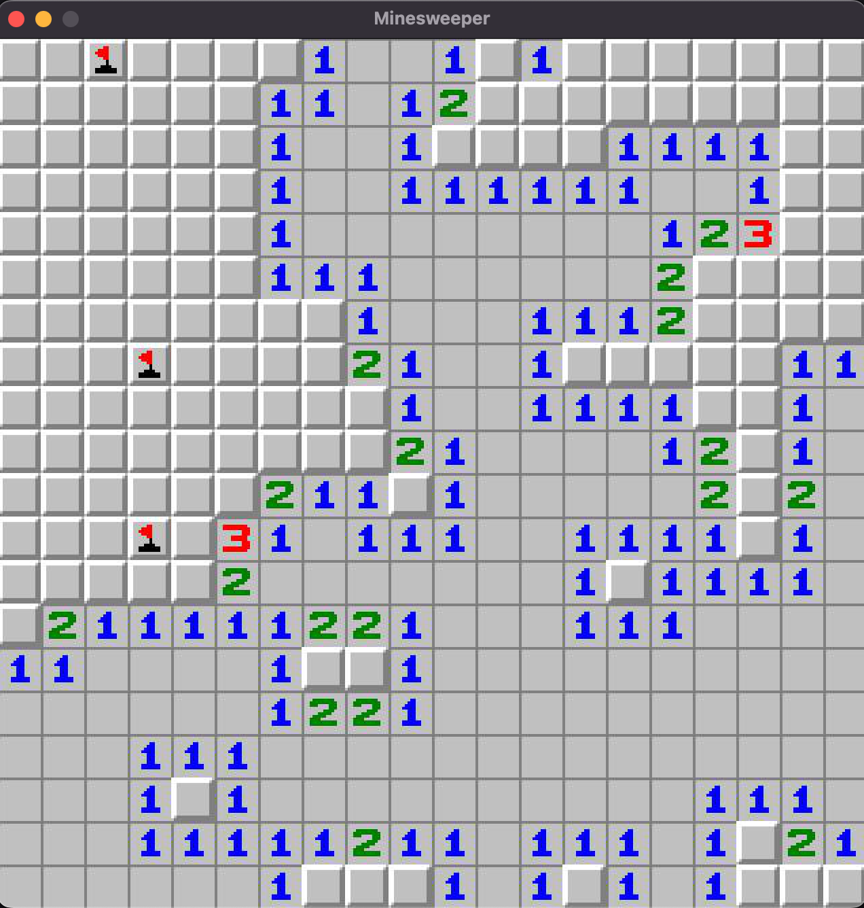

# Minesweeper (Console)

### About

The project was developed for Object-Oriented Programming - Laboratory by Eren Balci using C++.

### History of the game

According to TechRadar, Minesweeper was created by Microsoft in the 1990s, but Eurogamer commented that Minesweeper gained a lot of inspiration from a "lesser known, tightly designed game", Mined-Out by Ian Andrew for the ZX Spectrum in 1983. According to Andrew, Microsoft copied Mined-Out for Microsoft Minesweeper.

### Project Structure

A structure similar to the MVC(Model View Controller) structure was used. The files are separated into logic and ui, making management easier.

### Libraries

The project was made only using standard libraries.

### Commands

Only build the game

```bash
make build
```

Build and run the game

```bash
make minesweeper
```

### Images



